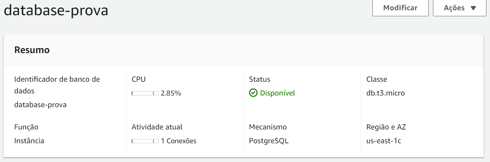
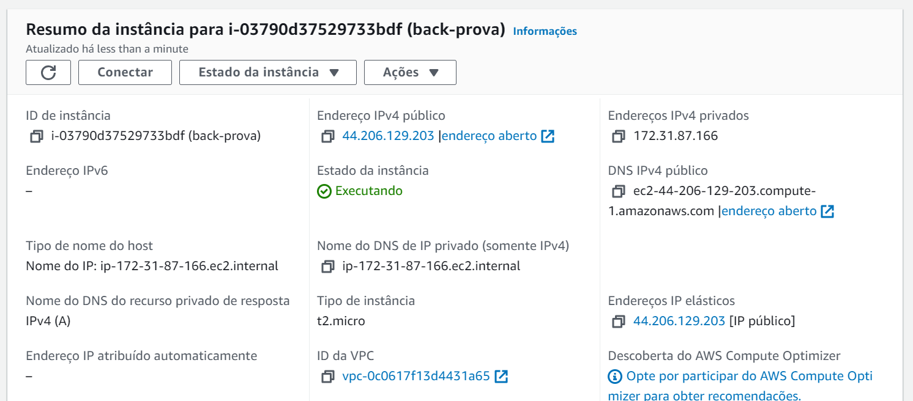
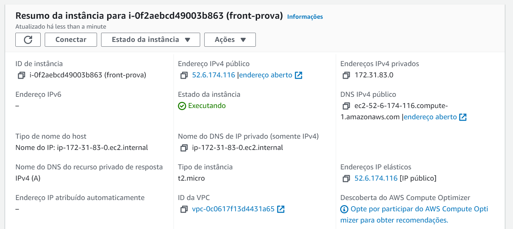
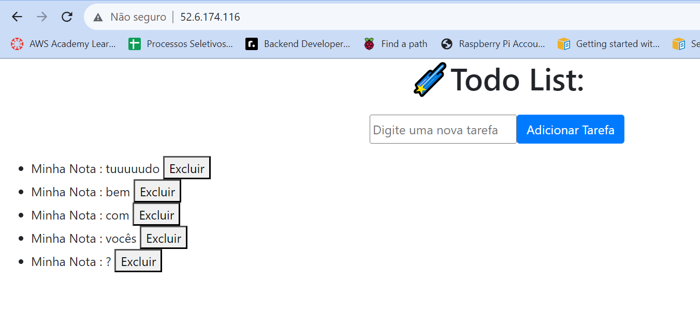

# Explicação Prova

## RDS

Primeiro, o banco foi criado com o serviço RDS da AWS, utilizando o PostgreSQL como mecanismo e não esquecendo de deixar ele público. Isso, vai fazer com que o endpoint do banco seja criado, por meio dele, nós conseguimos nos conectar o banco e criar nossas tabelas. Inicialmente, foi tentado fazer essa conexão por meio de um script python, mas não deu nada bom, então, por meio do DBeaver, nos conectamos e usamos comandos SQL. Por sim, para que seja possível a conexão com o banco, adicionamos uma regra de segurança que redireciona todas as TCPS para 0.0.0.0/0.

## Backend

No backend, foi criada uma instância utilizando o EC2 e a alocação de um IP elásticos, eles são utilizados para que o ip da máquina permaneça constante e não mude cada vez que a máquina for reiniciada. Também, foi adicionada uma regra de segurança que transferia os acessos feitos para a porta 5000, que estava sendo utilizada na inicialização do servidor FastAPI, para 0.0.0.0/0.

Antes de rodarmos o servidor, precisamos modificar, dentro do script do back, as informações do nosso banco, para que a conexão seja feita corretamente. Utilizamos novamente o endpoint dado pela AWS dentro do nosso arquivo main.py.

Então, nos conectamos a instância para utilizarmos o console. Nele, atualizamos as pendências antes de instalar o Python. Para termos acesso aos scripts do back, clonamos o repositório do GitHub onde ele se encontra. Dentro da pasta de back, baixamos todas as dependências e rodamos o servidor.

## Frontend

No frontend, foi utilizado outra instância do EC2. Então, novamente, depois da sua criação, devemos alocar um IP elástico para essa instância. Mas, antes de nos conectarmos ao console, precisamos modificar para onde o fetch do front será realizado. Logo, pegamos o IP público da instância do back e utilizamos ele no fetch, junto com a porta que rodamos o servidor.
Agora, podemos nos conectar ao console e repetir o primeiro passo do back, que é atualizar as pendências antes de instalar o ApacheJS, que nos servirá o front. Depois, fazemos o clone do repositório novamente. Para que o Apache tenha acesso aos nossos arquivos, temos que copiá-los dentro do caminho /var/www/html, para isso, utilizamos o comando cp do Linux, adicionando primeiro o local do remetente, que seria o conteúdo da nossa pasta frontend, para depois adicionar o destinatário, que seria o caminho do Apache.

Para acessar a aplicação, as instâncias precisam estar disponíveis. Então, só acessar o IP da sua instância de front pelo navegador. O resultado será o seguinte:

